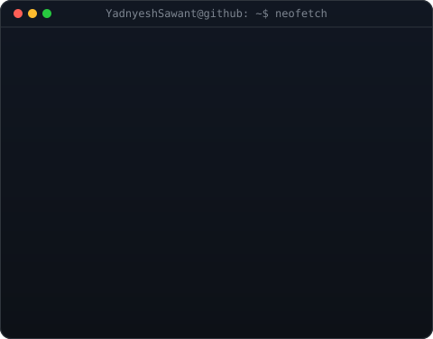
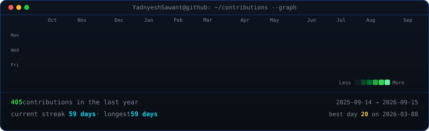

<!-- hero: monochrome ASCII portrait (types in) beside a neofetch-style info
     panel. regenerate portrait: python scripts/prep_photo.py <photo> &&
     python scripts/make_ascii_svg.py ; info panel: python scripts/make_info_card.py -->

<h3><code>YadnyeshSawant@github ~ $ whoami</code></h3>

<table>
<tr>
<td valign="top"></td>
<td valign="top"></td>
</tr>
</table>

 

I am an **MCA student and software engineer** focused on designing reliable backend systems, data-driven applications, and practical AI solutions. My engineering foundation spans **Java, Spring Boot, Python, PostgreSQL, MySQL, REST APIs, ORM, Data Structures, and Object-Oriented Programming**.

I enjoy working beyond individual features—thinking about **system architecture, database design, API contracts, security, maintainability, performance, and the complete product lifecycle**.

My work also extends into **Artificial Intelligence, Natural Language Processing, data engineering, and automation**. I have worked with large-scale question-answering datasets, multilingual translation models, paraphrasing pipelines, Hugging Face Transformers, and data-processing workflows.

Alongside engineering, I currently serve as a **Student Placement Representative at MIT World Peace University**, strengthening my experience in communication, coordination, leadership, and working across technical and non-technical stakeholders.

### Open To

`Software Engineering` · `Backend Engineering` · `Data Engineering` · `AI/ML Engineering` · `Full-Stack Development` · `Open Source` · `Research Collaborations`

---

## Tech Stack

### Languages

### Frontend

### Backend & Databases

 

### Cloud, DevOps & Tooling

 

---

 
 

<!-- contribution activity graph -->
<h3><code>YadnyeshSawant@github ~ $ ./activity.sh</code></h3>

 
 

<!-- animated contribution graph: real data, boxes reveal cell by cell
     (regenerated daily by .github/workflows/update-profile-art.yml) -->

<h3><code>YadnyeshSawant@github ~ $ ./contributions.sh</code></h3>

 
 

## Contribution Snake

<table>
  <tr>
    <td align="left"><code>🎮 PROFILE_SNAKE.EXE</code></td>
    <td align="center"><code>SCORE: <!-- snake_score -->432<!-- snake_score_end --></code></td>
    <td align="right"><code>HIGH: <!-- snake_high_score -->9,467<!-- snake_high_score_end --></code></td>
  </tr>
  <tr>
    <td colspan="3" align="center">
      <picture>
        <source
          media="(prefers-color-scheme: dark)"
          srcset="https://raw.githubusercontent.com/YadnyeshSawant/YadnyeshSawant/output/github-contribution-grid-snake-dark.svg"
        />
        <source
          media="(prefers-color-scheme: light)"
          srcset="https://raw.githubusercontent.com/YadnyeshSawant/YadnyeshSawant/output/github-contribution-grid-snake.svg"
        />
        
      </picture>
    </td>
  </tr>
</table>

 
 

<h3><code>YadnyeshSawant@github ~ $ ./links.sh</code></h3>

<!--  -->

 

  

 
 

## Certifications

### MongoDB

### Anthropic

### AWS

### Nova GenX Labs

### Cisco

### Microsoft

### Postman

### Oracle

### NPTEL

### LetsUpgrade

---

## Coding Profiles

